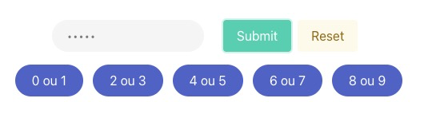

# Dynamic keyboard proof of concept

> Case 2: The pins are stored in plaintext in the database, permutations are done in the frontend but the mapping comes from the backend and changes for every session

## What is this?

Usually, especially in banks, you have to type a pin in a type of keyboard that looks like this:



This is a very common practice of preventing keyloggers from stealing your pin since the value in the button and the value in the input don't match as the button have multiple values.

I got curious after seeing [this tweet](https://twitter.com/niagalves/status/1719695627586580728), about how we could implement that, and this was a nice challenge.

# How this case works

For this case, we are running a session-based keyboard. Every time you enter the page, a new request is sent to the `/config` endpoint in the backend, which returns a new mapping for the keyboard, along with a session cookie that is used to identify that session and that keyboard mapping.

> For now, this mapping is not being used in the backend, but it's a initial step towards a more secure implementation where the backend only receives the indexes of the buttons that were pressed and not the actual values.

The keyboard mapping is a matrix of numbers in a 5x2 format, where each index represents a button in the keyboard, and the value of the indexes are the values that will be shown in the button. For example, the following matrix is a valid keyboard mapping:

```js
[
  [1, 2],
  [3, 4],
  [5, 6],
  [7, 8],
  [9, 0],
]
```

This array is shuffled using the [Fisher-Yates algorithm](https://en.wikipedia.org/wiki/Fisher%E2%80%93Yates_shuffle) to generate a random permutation of the keyboard, and then it's sent to the frontend. Sessions are stored in memory in the backend for 5 minutes, after that, they are deleted.

1. The pins are stored in plaintext in the database
2. The whole cartesian permutation of the keyboard is done in the frontend

The idea is to have a dynamic keyboard, which means that the mapping of the keyboard is not the same for each user, it can also vary depending on the session for the same user. The whole cartesian permutation of the keyboard is done in the frontend, which means that the backend only receives the collection of possible pins in plaintext so it can compare with the pins it has stored locally in memory (we have some test users with some pins in the [server file](./src/server.ts)).

# How to run

**Needs Node v20.6.0 or higher**

The project is done as a single front-end and backend application using Vue and Koa. So after cloning the repo and getting to the branch you want to test, you can run the following commands:

```bash
npm install
npm run start
```

The application will run on port 3000, just go to `http://localhost:3000` and see the frontend working.

I'm also sending the `.env` file for reference when required, you can set the `PORT` variable there and other variables that are needed for other cases.
